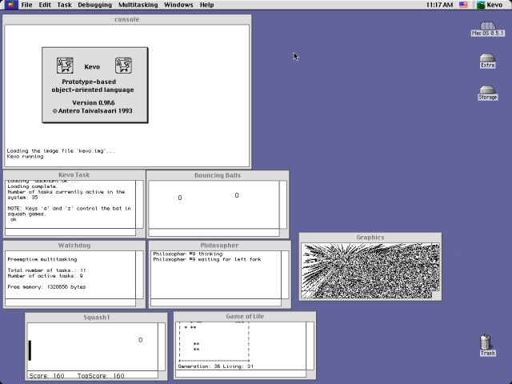

# kevo
Mirror of Kevo 0.9b6 by Antero Taivalsaari from https://www.macintoshrepository.org/52313-kevo-0-9b6
  

 
I found this via https://www.bradrodriguez.com/papers/oofs.htm

Kevo is a prototype-based language related to forth.
>Kevo is a prototype-based object-oriented system build around a very simple object model. Unlike most object-oriented systems, Kevo does not have classes. And unlike the few other prototype-based object-oriented systems (such as Self), Kevo does not feature delegation. Instead of classes and delegation, Kevo is based on concatenation: unrestricted composition of object interfaces. In concatenation, objects are derived from each other simply by cloning (copying) and subsequently modifying them so as to differentiate them from each other. The Kevo system automatically maintains information about clone families (groups of similar objects) and their derivation relationships. 
  
Taivalsaari, Antero. (1993). Kevo User's Guide. Victoria, B.C.

>A prototype-based object-oriented language written for Macintosh by Antero Taivalsaari at UTA, Finland. Kevo is built around a threaded code interpreter and features a unique prototype-based object model (which is based neither on classes nor Self-style delegation), pre-emptive multitasking, cooperative multitasking, dynamic memory management, an icon-based object browser and editor modelled loosely after Mac Finder. Kevo's syntax is close to Forth and its semantics resembles Self and Omega.
  
TR DCS-197-19, U Victoria, June 1992

It uses purely concatenative inheritance, which Javascript also uses, see
https://medium.com/javascript-scene/the-heart-soul-of-prototypal-oo-concatenative-inheritance-a3b64cb27819

>Because dynamic object extension is so common in JavaScript, and so fundamental to so many common JavaScript idioms, it is the most commonly used form of inheritance in JavaScript. It is not widely recognized as such because it is not what people think of when they think of the word, “inheritance”.

# Licence is replicated below:
KEVO LICENSE

Kevo is distributed by Antero Taivalsaari, who hereby grants
to you a non-transferable license to use, copy, and distribute 
Kevo for non-commercial purposes, subject to your agreement to 
the following terms and conditions:

  - This license must be retained in all copies of Kevo (full 
    or partial; original, modified, derivative, or otherwise):

  - You acquire no ownership right, title, or interest in Kevo
    except as provided herein.

  - Kevo is a research work which is provided 'as is', and Antero
    Taivalsaari disclaims all warranties with regard to this software.
    In no event shall Antero Taivalsaari be liable for any direct, 
    indirect, or consequential damages arising out of or in connection 
    with the use or performance of this software. 

       Copyright (c) Antero Taivalsaari 1993
       All Rights Reserved
